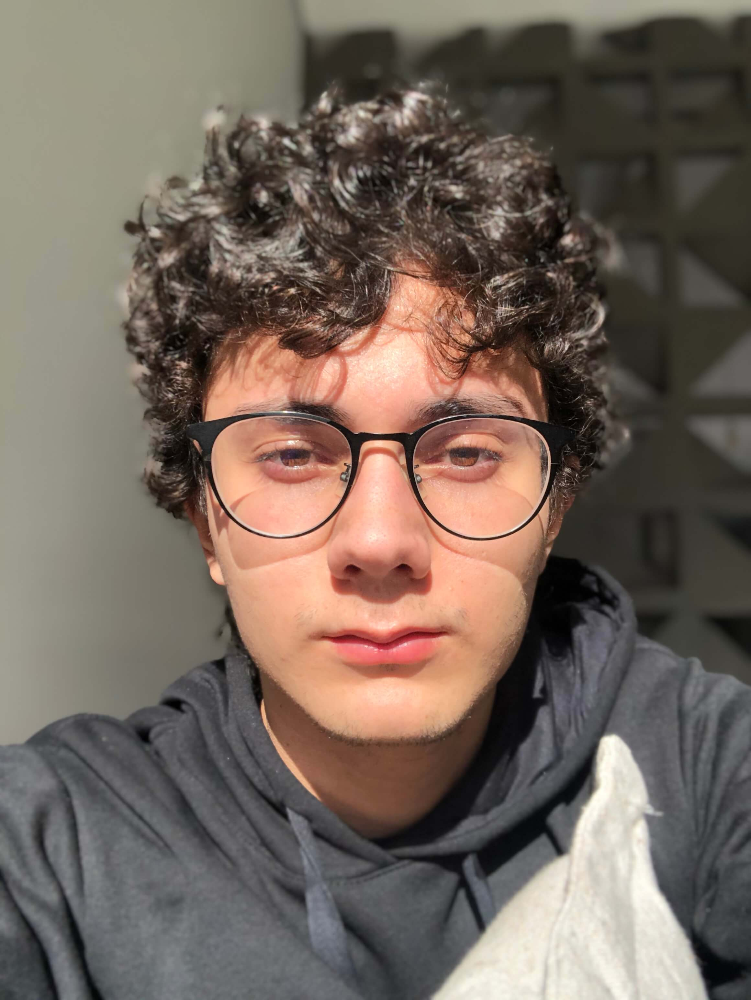

## Sobre mim

Olá, bem-vindo ao meu site! Sou desenvolvedor, tenho 20 anos e estou cursando o quinto semestre em Engenharia de Software na Pontifícia Universidade Católica de Campinas.

---

## Experiências

Fev. 2021 - Atual

**Estagiário em Engenharia de Software** @ <a href="https://www.linkedin.com/company/daitan-group/" target="_blank">Daitan Group</a>

Jun. 2019 - Jan. 2021

**Estagiário em Engenharia de Software** @ <a href="https://www.linkedin.com/company/superopabrasil/" target="_blank">SuperOpa</a> e <a href="https://www.linkedin.com/company/opa-tech/" target="_blank">OpaBox</a>

Desenvolvimento Fullstack em Flutter e Javascript baseado em componentização de software utilizando microservices e soluções escaláveis para APIs, desenvolvimento recursos disponíveis a partir de RESTful Web Services, uso do Vue.js como framework Javascript, Node.js como ambiente de execução Javascript server-side. Experiência com metodologias Ágeis (SCRUM e Kanban), uso do Git para controle de versões, Slack para comunicação entre colaboradores, gerenciamento de projeto pelo Jira e Trello. Implementação de testes em APIs ou Webservices a partir do Postman, habituado com Arquitetura Serverless disponibilizado pela AWS (S3, DynamoDB, CloudFront, API Gateway, CloudWatch, SQS).

---

## Formação acadêmica

**Pontifícia Universidade Católica de Campinas**

Bacharelado, Engenharia de Software

2019 – 2022

**ETEC Bento Quirino** 

Técnico Integrado ao Ensino Médio, Informática

2016 - 2018

---

## Habilidades interpessoais

- Criatividade, Persuasão, Colaboração, Adaptabilidade, Gestão do Tempo
  
- Organização de grupos, Negociação de soluções, Empatia, Sensibilidade social
  
- Autoconhecimento emocional, Controle emocional, Automotivação
  
- Reconhecimento de emoções em outras pessoas, Habilidade em relacionamentos interpessoais

---

## Habilidades técnicas

- JavaScript, Dart, C, Java, SQL, NoSQL, PHP, HTML5, CSS3, Node.js

- Flutter, Vue.js, Bootstrap, Express.js, API REST, Serverless Framework

- Amazon DynamoDB, AWS Lambda, S3, CloudFront, API Gateway, CloudWatch, SQS

- MySQL, Git, Jira, Trello, Figma, Postman, Slack, SCRUM, Kanban

---

## Contribua com o meio ambiente

Os recursos naturais do planeta são finitos e sofrem ameaça de escassez. Ações concretas e imediatas são essenciais e dependem da sua doação. Escolha uma das ONGs abaixo, que enfrentam diariamente a batalha para salvar nosso planeta, e faça já sua doação.

- <a href="https://www.sosma.org.br/doacao/" target="_blank">Fundação SOS Mata Atlântica</a>
  
A SOS Mata Atlântica atua há 30 anos na proteção da Mata Atlântica, que abriga mais de 72% dos brasileiros. A ONG realiza projetos em áreas como monitoramento e restauração da Mata Atlântica, proteção do mar e da costa, políticas públicas e melhorias das leis ambientais, educação ambiental e campanhas e apoio a unidades de conservação.

- <a href="https://www.sospantanal.org.br/doacoes/" target="_blank">Instituto SOS Pantanal</a>
  
Com representantes dos diversos setores da sociedade pantaneira o SOS Pantanal surge em um momento especial, em que a necessidade da gestão do conhecimento e do diálogo intersetorial são fundamentais para a conservação da biodiversidade e dos recursos naturais do planeta. Esta nova proposta chega para somar com outras iniciativas da região, com o intuito de tornar-se uma ferramenta fundamental na facilitação do diálogo.

- <a href="https://oncafari.org/doe-agora/" target="_blank">Projeto Onçafari</a>
  
Trabalhamos pela proteção das onças-pintadas no Pantanal sul-mato-grossense e iniciamos atividades em Mogi Guaçu, no interior de São Paulo, para a preservação dos lobos-guará.

O Onçafari atua e três frentes principais:

1. Onçafari Ecotourism: trabalha para habituar animais (mantê-los totalmente selvagens e livres, sem que se sintam ameaçados), como a onça-pintada e o lobo-guará, à presença dos veículos da equipe. À medida que os animais deixam de fugir na presença dos carros, não veem mais pesquisadores e visitantes como ameaça. A partir daí, é possível desenvolver o ecoturismo na região.
   
2. Onçafari Science: tem por objetivos monitorar a saúde dos animais que o projeto preserva e estudar seus comportamentos, fisiologia e ecologia, aumentando o conhecimento científico sobre a espécie e potencializando sua proteção.
   
3. Onçafari Rewild: reintroduz em seu habitat natural filhotes de onças-pintadas resgatados.